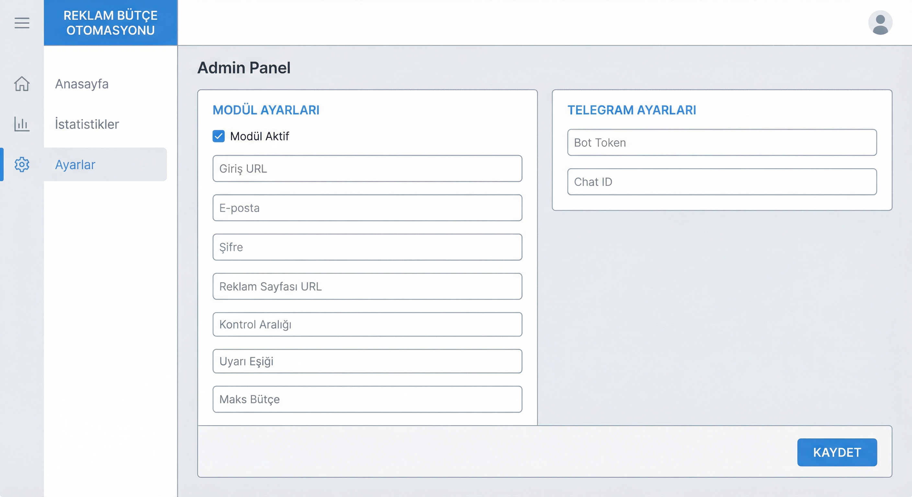
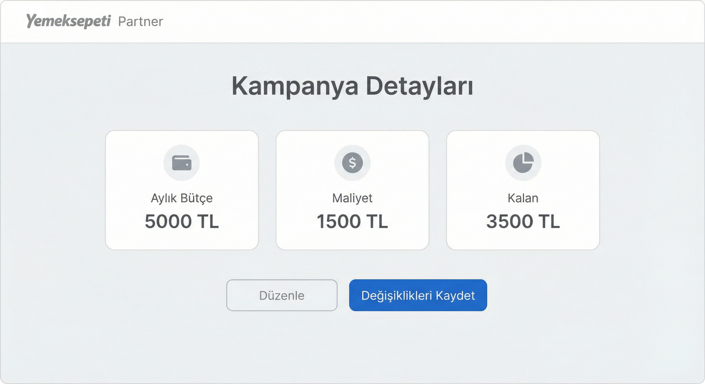

# Yemeksepeti Reklam Bütçe Otomasyonu – Kılavuz

Bu kılavuz, Yemeksepeti reklam bütçe otomasyonunun kurulumu ve kullanımı için adım adım rehberdir.

---

## Genel Bakış

Reklam modülü:

- Reklam bütçesini periyodik olarak kontrol eder
- Uyarı eşiğinin altına inince Telegram’a bildirim gönderir
- Telegram üzerinden `/butce <tutar>` ile bütçe güncelleme onayı alır

Bütçe **okuma** campaigns API (network) üzerinden yapılır. Bütçe **güncelleme** iki şekilde çalışır: `.env` içinde `YS_ADS_BUDGET_UPDATE_API_URL` tanımlıysa bu servis (PATCH) ile yapılır; tanımlı değilse ekrandaki “Düzenle” akışı (Playwright) kullanılır.

---

## Kurulum Adımları

### 1. Admin Panel Ayarları

Admin panelde **Yemeksepeti → Reklam Bütçe Otomasyonu** sayfasını açın:

| Alan | Açıklama |
|------|----------|
| **Modül Aktif** | `true` – Reklam modülünü etkinleştirir |
| **Giriş URL** | Yemeksepeti partner giriş adresi (örn. `https://partner.yemeksepeti.com/`) |
| **E-posta** | Partner panel e-posta adresi |
| **Şifre** | Partner panel şifresi |
| **Reklam Sayfası URL** | Reklam kampanya sayfası URL’i (örn. `https://partner-app.yemeksepeti.com/advertising/reporting/landing`) |
| **Kontrol Aralığı (dk)** | Bütçe kontrol sıklığı (dakika) |
| **Uyarı Eşiği (TL)** | Bu tutarın altına inince Telegram uyarısı tetiklenir |
| **Maks Bütçe (TL)** | `/butce` ile izin verilen üst limit |
| **Bütçe güncelleme API URL** | (Opsiyonel) `YS_ADS_BUDGET_UPDATE_API_URL` – adtech-gateway PATCH URL’i (örn. `https://adtech-gateway.deliveryhero.io/v1/shared/entities/YS_TR/campaigns`). Tanımlıysa bütçe ekran yerine bu API ile güncellenir; Bearer token kampanya sayfası açılırken yakalanır (gerekirse 20 sn aralıklarla ~1 saat denenir). |
| **PATCH body** | `campaign_id`, `vendor_id`, `promo_area_ids` campaigns API'den (campaigns[].id, advertiser.vendor_id, promo_areas). Alınamazsa `YS_ADS_*` fallback. |
| **bid, is_auto_bidding, product_type** | `YS_ADS_BID`, `YS_ADS_IS_AUTO_BIDDING`, `YS_ADS_PRODUCT_TYPE` – .env veya panelden. |



### 2. Telegram Ayarları

| Alan | Açıklama |
|------|----------|
| **Bot Token** | Reklam modülü için ayrı Telegram bot token’i (opsiyonel) |
| **Chat ID** | Hedef grup veya kanal ID’si; panelden “Chat ID Bul” ile otomatik alınabilir |

Telegram botuna `/start` yazıp, panelde **Chat ID Bul** ile eşleştirin.

### 3. Reklam Sayfası URL’ini Bulma

1. Tarayıcıda Yemeksepeti Partner paneline giriş yapın
2. **Reklam** / **Premium Yerleşim** menüsüne gidin
3. Kampanya özeti veya detay sayfasına tıklayın
4. Adres çubuğundaki tam URL’i kopyalayın (örn. `https://partner-app.yemeksepeti.com/advertising/...`)



---

## Akış Diyagramı

```
┌─────────────┐     ┌──────────────────┐     ┌─────────────────────┐
│   Login     │────▶│ Reklam Sayfası   │────▶│ Kampanya Detayları  │
│ (YS_EMAIL)  │     │ (promotion)      │     │ (Aylık Bütçe, vb.)  │
└─────────────┘     └──────────────────┘     └──────────┬──────────┘
                                                        │
                     ┌──────────────────────────────────┘
                     ▼
              ┌──────────────┐     ┌─────────────────────┐
              │ Kalan < Eşik │────▶│ Telegram Uyarı      │
              └──────────────┘     │ /butce ile onay     │
                                   └─────────────────────┘
```

---

## Telegram Komutları

| Komut | Açıklama |
|-------|----------|
| `/durum` | Anlık reklam bütçe durumunu gösterir |
| `/butce <tutar>` | Reklam bütçesini belirtilen tutara günceller |
| Sadece sayı (örn. `7000`) | Bekleyen uyarı varsa bütçeyi o değere günceller |
| `/iptal` | Bekleyen reklam uyarısını temizler |

---

## Sayfa Yapısı (Yemeksepeti Arayüzü)

Sistem aşağıdaki metinleri otomatik tanır:

- **Aylık bütçe** / Monthly budget
- **Maliyet** / Harcanan
- **Kalan** / Remaining
- **Kampanya detayları** / Kampanyayı düzenle

Düzenleme akışı: “Düzenle” butonu → Aylık Bütçe alanı → “Değişiklikleri Kaydet” → varsa onay pop-up’ı.

Bu adımlar sistem tarafından işlenir; kullanıcı müdahalesi gerekmez.

---

## Robot / CAPTCHA Sorunlarında Alternatif Ayarlar

| Alan | Öneri |
|------|-------|
| `YS_ADS_HEADLESS` | `false` – Tarayıcı penceresi görünür açılır, bot tespiti azalır |
| `YS_ADS_CHECK_INTERVAL_MIN` | `180` – Seyrek tarama (3 saatte bir) |
| Robot doğrulama | Robot penceresi açılırsa 90 sn beklenir; bu sürede manuel tamamlayabilirsiniz |

---

## Sorun Giderme

### “Reklam sayfası doğrulanamadı”
- `YS_EMAIL` ve `YS_PASSWORD` ile manuel giriş yapıp reklam sayfasına erişebildiğinizi doğrulayın

### “Bütçe düzenleme alanı bulunamadı”
- Sayfa tam yüklenene kadar bekleyin (özellikle ilk açılışta)
- Robot / captcha benzeri bir doğrulama varsa önce manuel tamamlayın

### Telegram’da mesaj gelmiyor
- `YS_ADS_TELEGRAM_BOT_TOKEN` ve `YS_ADS_TELEGRAM_CHAT_ID` doğru mu kontrol edin
- Bota `/start` gönderip Chat ID’yi panelden tekrar almayı deneyin

### Debug
Hata durumunda `data/debug/` altında `ys-ads-page.html` ve `ys-ads-page.png` oluşur. Bu dosyalar sorun tespitinde yardımcı olur.

### Docker ile çalışırken
- Compose’u **proje kökünden** çalıştırın; `.env` ve `./data` volume’ları böyle doğru bağlanır.
- Robot / CAPTCHA durumunda oturumu host’ta yenilemek için: `YS_ADS_HEADLESS=false npm run auth:ads` (oturum `./data`’ya yazılır, container aynı volume’u kullanır).
- Ayrıntılar için [DOCKER.md](DOCKER.md) belgesine bakın.

---

## Ekran Görüntüsü Rehberi (Katkıda Bulunmak İçin)

Kılavuzu güçlendirmek için aşağıdaki ekran görüntülerini ekleyebilirsiniz:

| Dosya | İçerik |
|-------|--------|
| `docs/reklam-kilavuzu/admin-panel.png` | Admin panel – Reklam Bütçe Otomasyonu ayarları |
| `docs/reklam-kilavuzu/reklam-sayfasi.png` | Yemeksepeti reklam kampanya detay sayfası |
| `docs/reklam-kilavuzu/telegram-ornek.png` | Telegram’da /durum ve /butce örnekleri |

Görüntüler ekledikten sonra bu belgedeki ilgili `![...]` bağlantıları otomatik olarak çalışır.
